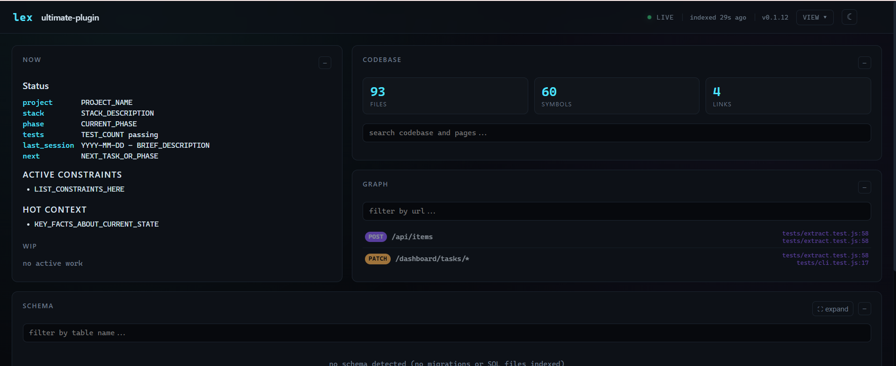
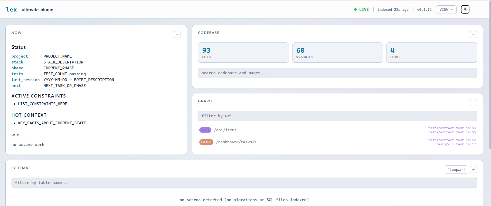
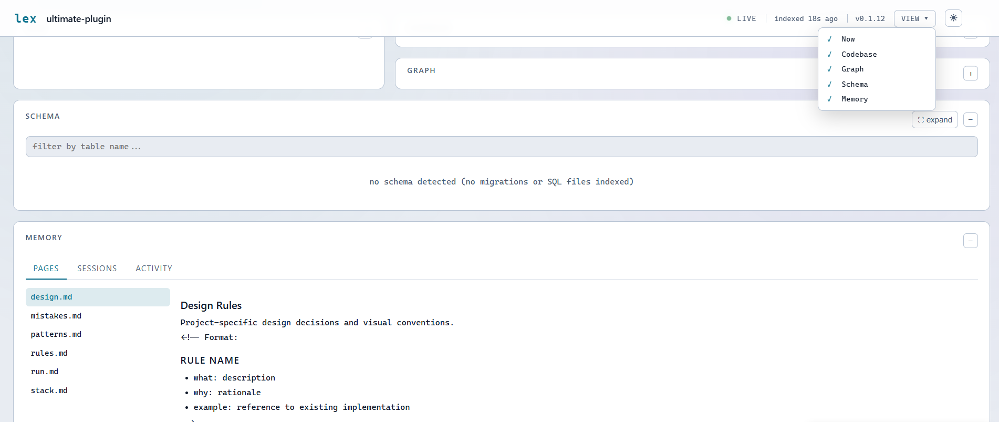

<div align="center">

# lex

### The shared brain for AI coding agents.

Cross-agent project memory, enforcement rules, and a live viewer.  
Works on Claude Code, Cursor, Windsurf, Codex, Gemini, Copilot, Antigravity, Kimi, and any agent that can read files.

[](#)
[](#)
[](LICENSE)
[](#)
[](#)
[](#platform-support)

[Quick Start](#quick-start) &bull; [CLI](#cli) &bull; [Gateway](#gateway) &bull; [Viewer](#viewer) &bull; [Skills](#skills) &bull; [Docs](#docs)

</div>

---

## The problem

You're building a feature in Claude Code. You hit a usage limit mid-task. You open
Cursor, or Windsurf, or Trae - and now you're explaining everything again. What you
were doing. What you already tried. What broke last time. The new agent has no memory
of the last one.

Multiply that across three projects and it's a constant tax: re-explaining,
re-discovering, occasionally re-breaking something that was already fixed.

**lex exists because the chat window was never the right place to keep a project's
memory.** The chat is disposable. `.lex/` is not.

### The test lex is built to pass

> Start a task in Claude Code. Close it mid-way. Open Cursor. Type "continue".  
> The agent picks up exactly where the last one left off - same knowledge, same
> discipline, same taste, on a completely different tool, with zero re-explaining.

---

## Demo

<table>
  <tr>
    <td align="center"><b>Dark mode</b></td>
    <td align="center"><b>Light mode</b></td>
  </tr>
  <tr>
    <td></td>
    <td></td>
  </tr>
</table>



```bash
# Run the viewer
node bin/lex.js serve

# Catch secrets before they ship
node bin/lex.js guard

# Search without reading files
node bin/lex.js search "userTask overdue"
```

---

## Why it's cheap on tokens

The usual way an agent "understands" a codebase is expensive: grep for a term, read
the whole file that matched, read three more files to find where something else is
defined, read every migration to piece together the database. Each read costs tokens,
and most of a 500-line file is irrelevant to the one function you needed.

**lex replaces that pattern with a query:**

```bash
lex search loadAgentConfig
# → lib/indexer.js:42  function loadAgentConfig(root) {
# → tests/indexer.test.js:88  test('loadAgentConfig returns defaults')
# 2 files, ~248 tokens. grep would return ~4,880.
```

On a 45K-file repo, a common query like `ocr` returns 224 tokens via lex vs **6.7
million tokens** via grep. That's not a savings - it's the difference between working
and crashing.

Full benchmarks: [docs/benchmarks.md](docs/benchmarks.md)

---

## What it does

| Feature | What it means |
|---------|---------------|
| **Continuity engine** | Three-layer state protection - `wip.md` checkpoints, ~80% context flush, hooks. Sessions survive compaction, crashes, and handoffs to a different agent |
| **Enforcement** | PostToolUse hook warns if `wip.md` missing, auto-logs edits to `audit.log`. Git pre-commit hook runs `lex guard` and blocks on CRITICAL violations |
| **Project memory** | `.lex/` folder with knowledge pages, session summaries, audit trail. Any agent that can read a file gets the full picture |
| **lex-index** | Self-maintaining SQLite index - `search`, `symbols`, API-to-frontend `links`, DB schema map. Zero tokens to maintain |
| **lex guard** | Scans for exposed secrets (CRITICAL) and DB anti-patterns (IMPORTANT) before every commit |
| **Browser audit** | `lex audit` launches headless Chrome/Edge, crawls all internal pages, captures console errors + network failures. Supports login automation via `.lex/audit.json` |
| **Live viewer** | `lex serve` opens a mission-control dashboard - live status, task list, knowledge, schema, search, agent activity |
| **Reasoning skills** | 16 skills: brainstorming, planning, TDD, debugging, verification, code review, and more |
| **Stack overlays** | PHP? Agent uses Xdebug. Rust? Agent uses `dbg!` and audits `unsafe`. 5 overlay packs auto-detect at `lex init` |
| **Gateway** | 18 commands via `write_to_file` — zero user approval, zero shell quoting |
| **Zero dependencies** | Pure markdown + one small Node script. No build step, no server, nothing to update |

One plugin replaces the separate reasoning, style, and memory tools you'd otherwise
stitch together - and it works identically on **9+ platforms**.

---

## Quick Start

### 1. Install

**One-line (npm global — recommended):**
```bash
npm install -g @atul-labs/lex
```
Then use `lex` from anywhere:
```bash
lex init          # initialize .lex/ in your project
lex serve         # live viewer at http://localhost:4747
lex audit         # headless browser audit of your dev server
lex guard         # scan for exposed secrets before commit
```

**Or per-platform plugin:**

**Claude Code:**
```bash
claude plugin install github:ATUL-Labs/lex
```

**Codex:**
```bash
codex plugin install github:ATUL-Labs/lex
```

**Gemini CLI:**
```bash
gemini extensions install github:ATUL-Labs/lex
```

**Cursor / Windsurf:** Auto-detected from plugin manifests. No manual setup.

**Any agent:** If it can read files, lex works. Point it at `skills/using-lex/SKILL.md`.

<details>
<summary>More install options (per-project, clone, Trae, manual)</summary>

#### Per-project (clone and link)
```bash
git clone https://github.com/ATUL-Labs/lex.git
cd lex && npm link   # makes `lex` available globally
```

#### Per-project (drop into codebase)
```bash
cp -r lex-plugin/skills/ .          # Skills folder - agents auto-discover
cp lex-plugin/CLAUDE.md .           # Claude Code / Cursor / Windsurf
cp lex-plugin/AGENTS.md .           # Codex / Copilot / Windsurf
cp lex-plugin/GEMINI.md .           # Gemini CLI
```

#### Trae (no plugin system)
```bash
mkdir -p .trae/rules
cp <lex-repo>/templates/platform/trae-rules.md .trae/rules/project_rules.md
```
</details>

### 2. Initialize

Tell your agent:
```
Initialize lex for this project
```

Or run directly:
```bash
node <lex-repo>/bin/lex.js init
```

This creates `.lex/` with `status.md`, `INDEX.md`, knowledge pages, and detects your
stack (PHP, Rust, Python, TypeScript, Go) to load the right overlays.

### 3. Start working

The plugin activates automatically every session. The agent reads `.lex/status.md`,
checks for `wip.md` (crash recovery), and loads only the knowledge pages relevant to
the current task.

---

## CLI

Requires Node 22+.

```bash
node <lex-repo>/bin/lex.js init [dir]                # scaffold .lex/ from templates
node <lex-repo>/bin/lex.js guard                      # scan for exposed secrets + DB anti-patterns
node <lex-repo>/bin/lex.js check                      # pre-flight: wip.md, index, guard
node <lex-repo>/bin/lex.js tokens                     # session token usage + context budget
node <lex-repo>/bin/lex.js search userTask overdue   # full-text, fuzzy + line numbers
node <lex-repo>/bin/lex.js grep "TODO|FIXME"         # regex search (patterns FTS can't do)
node <lex-repo>/bin/lex.js symbols src/App.tsx       # symbol list without reading the file
node <lex-repo>/bin/lex.js links dashboard/tasks     # route + every frontend consumer
node <lex-repo>/bin/lex.js recent 20                 # recently modified files from audit log
node <lex-repo>/bin/lex.js errors                    # console errors captured from browser
node <lex-repo>/bin/lex.js audit [urls...]           # headless browser audit (auto-detects dev server)
node <lex-repo>/bin/lex.js patch <file> <mode> ...   # surgical edit by anchor (saves tokens)
node <lex-repo>/bin/lex.js ls [dir]                  # list files from index (instant)
node <lex-repo>/bin/lex.js read <file> [start-end]   # read file with line numbers
node <lex-repo>/bin/lex.js refresh                   # manual reindex (rarely needed)
node <lex-repo>/bin/lex.js watch [port]              # server + file watcher, instant search
node <lex-repo>/bin/lex.js serve [port]              # live viewer, defaults to 4747
```

**`guard`** scans all source files for hardcoded API keys, passwords, tokens,
connection strings (CRITICAL - exits with code 1 if found), and database
anti-patterns like 1-to-1 tables, EAV, and settings tables (IMPORTANT).
**Run it before every commit.**

**`watch`** starts the viewer server with a file watcher. Files are re-indexed
automatically on save (debounced 300ms). When `watch` is running, `lex search`
routes through the server via HTTP — cutting latency from ~200ms to ~15ms.

Large legacy folders: list path prefixes in `.lex/ignore` (one per line) to exclude
them from indexing.

### `patch` — surgical edits

```bash
# Insert after an anchor
lex patch src/app.js after "const x = 1" --insert "const y = 2;"

# Replace an anchor
lex patch src/app.js replace "oldFunction()" --insert "newFunction()"

# Compact pipe format (41% shorter than JSON)
echo 'src/app.js|after|const x = 1|const y = 2;' | lex patch

# JSON mode (for agents)
lex patch '{"file":"src/app.js","anchor":"const x = 1","insertion":"const y = 2;","mode":"after"}'
```

**Smart features:** auto-anchor (shortest unique substring), fuzzy match (typo
tolerance with similarity %), diff output on every patch, preview mode, multi-match
context.

**Safety:** `rm` moves files to `.lex/trash/` with a timestamp prefix. `mv` backs up
the destination before overwriting. Both report the trash path for recovery.

### `audit` — headless browser runtime check

```bash
# Auto-detect dev server, crawl all pages (default: depth 2, max 30 pages)
lex audit

# Explicit URLs
lex audit http://localhost:3000 http://localhost:5173

# Single page, no crawling
lex audit --no-crawl http://localhost:3000

# Deep crawl (depth 4, up to 100 pages)
lex audit --depth=4 --max-pages=100

# JSON output for agents
lex audit --json

# Wait longer for slow pages
lex audit --wait=5000
```

Launches your installed Chrome/Edge/Brave in headless mode, visits each URL,
and captures:
- **Console errors** — `console.error`, uncaught exceptions, unhandled rejections
- **Network errors** — HTTP 4xx/5xx responses, failed resource loads
- **Console warnings** — `console.warn`

**Crawling**: By default, after each page loads, lex extracts all `<a href>` links
on the same origin and visits them too (BFS, up to `--depth` and `--max-pages`).
This catches errors on every page — dashboard, settings, login, etc.

**Login support**: Create `.lex/audit.json` (gitignored — may contain credentials):

```json
{
  "login": {
    "url": "/login",
    "fields": {
      "#email": "test@example.com",
      "#password": "testpass123"
    },
    "submit": "button[type=submit]"
  },
  "crawl": true,
  "maxDepth": 3,
  "maxPages": 50,
  "waitMs": 3000
}
```

Lex logs in first, gets the session cookie, then crawls all authenticated pages.
A single browser tab is reused for the entire session so cookies persist.

Auto-detects browser path on Windows, macOS, Linux, and WSL. Zero dependencies —
uses Chrome DevTools Protocol over WebSocket (built into Node 22).

Via gateway (no approval needed):
```
write_to_file('.lex/in/audit.json', '', true)  # auto-detect URLs, crawl all pages
```

### Gateway: zero-approval lex commands

The gateway lets agents use lex **without `run_command`** — no user approval,
no shell quoting, no PowerShell escaping. The agent writes a request to
`.lex/in/` via `write_to_file` (a native tool), the PostToolUse hook processes
it, and the result is auto-injected as `additionalContext`.

**Three input formats** (pick the lightest):

```
# 1. Empty file = no-arg command (filename IS the command, 21% less overhead)
write_to_file('.lex/in/errors.json', '', true)

# 2. Plain text = cmd + args (17% less overhead than JSON)
write_to_file('.lex/in/r.json', 'search ValidationError')
write_to_file('.lex/in/r.json', 'grep res\\.status|src/app.js')

# 3. JSON = full control (backward compatible)
write_to_file('.lex/in/req.json', '{"cmd":"search","args":["InputError"]}')
```

**18 commands available:** `search`, `symbols`, `grep`, `read`, `patch`,
`insert`, `rename`, `delete`, `batch`, `diff`, `errors`, `audit`, `undo`,
`snapshot`, `refs`, `recent`, `links`, `guard`.

| Feature | Gateway (`write_to_file`) | CLI (`run_command`) |
|---------|--------------------------|---------------------|
| User approval | **Never** | Every call |
| Shell quoting | None | Required (PowerShell) |
| Output injection | Auto (`additionalContext`) | Manual (read stdout) |
| Batch support | Yes (1 call, N commands) | No (N calls) |
| Token overhead | 42-50 tokens | 24-28 tokens |

Gateway costs ~20 more raw tokens per call, but saves **all approval friction**
and enables **batching** (2 commands in 1 call saves 24%).

---

## Viewer

```bash
node <lex-repo>/bin/lex.js serve        # http://127.0.0.1:4747
node <lex-repo>/bin/lex.js serve 3000   # specific port
```

Live mission-control dashboard: status, task list, full-text search, API link graph,
schema ERD, knowledge pages, agent activity timeline. Dark/light theme, collapsible
panels. Read-only and localhost-bound.

Details: [docs/viewer.md](docs/viewer.md)

---

## Skills

16 skills, each a standalone `SKILL.md` with a `HARD-GATE` — written answers required
before proceeding. No gate, no code. Stack overlays (PHP, Rust, Python, TypeScript,
Go) auto-detect at `lex init` and add language-specific tooling guidance.

Full skill catalog: [docs/skills.md](docs/skills.md)

---

## How It Works

`.lex/` folder in each project root stores: `status.md` (current state), `wip.md`
(work-in-progress, exists only during active work), `INDEX.md` (knowledge table of
contents), `audit.log` (agent activity trail), knowledge pages, and session
summaries. Any agent that can read markdown can use it.

**Crash recovery:** `wip.md` checkpoints let the next agent resume exactly where the
last one left off — same knowledge, same discipline, on a completely different tool.

**Enforcement:** PostToolUse hook warns if `wip.md` missing, auto-logs edits. Git
pre-commit hook runs `lex guard` and blocks on CRITICAL violations.

Full architecture: [docs/how-it-works.md](docs/how-it-works.md)

---

## Platform Support

| Platform | How it activates | Install |
|----------|-----------------|---------|
| **Any CLI** | `lex` global command | `npm install -g @atul-labs/lex` |
| **Claude Code** | Shell hook at session start | `claude plugin install github:ATUL-Labs/lex` |
| **Codex** | Shell hook at session start | `codex plugin install github:ATUL-Labs/lex` |
| **Cursor** | Auto-detected from manifest | Drop in project root |
| **Windsurf** | `AGENTS.md` at session start | Auto-detected from `.windsurf/plugin.json` |
| **Copilot CLI** | Shares Claude Code mechanism | Same as Claude Code |
| **Gemini CLI** | `GEMINI.md` as context file | `gemini extensions install github:ATUL-Labs/lex` |
| **Kimi Code** | Manifest at session start | `/plugins install github:ATUL-Labs/lex` |
| **Antigravity** | `ANTIGRAVITY.md` context file | `agy plugin install github:ATUL-Labs/lex` |
| **Any agent** | Reads `skills/using-lex/SKILL.md` | Drop `skills/` in project root |

---

## Optional: code graph upgrade

lex-index answers "where is X used" with text search. For true call-graphs,
dead-code detection, and trace-paths on large codebases, add the MIT-licensed
[codebase-memory-mcp](https://github.com/DeusData/codebase-memory-mcp) (single
static binary, zero dependencies, fully local):

```bash
# macOS / Linux
curl -fsSL https://raw.githubusercontent.com/DeusData/codebase-memory-mcp/main/install.sh | bash
```

```powershell
# Windows
Invoke-WebRequest -Uri https://raw.githubusercontent.com/DeusData/codebase-memory-mcp/main/install.ps1 -OutFile install.ps1; .\install.ps1
```

lex works fully without it - skills prefer the graph when connected, fall back to
`lex search`, then grep.

---

## Docs

- [benchmarks.md](docs/benchmarks.md) — speed, token savings, gateway overhead, test results
- [skills.md](docs/skills.md) — full skill catalog, stack overlays
- [how-it-works.md](docs/how-it-works.md) — `.lex/` folder, crash recovery, enforcement, file structure
- [viewer.md](docs/viewer.md) — panel details, console error capture
- [upgrading.md](docs/upgrading.md) — safe upgrade path, no data loss
- [CHANGELOG.md](CHANGELOG.md) — version history

---

## Acknowledgments

- Cross-platform plugin delivery pattern inspired by [superpowers](https://github.com/obra/superpowers) by Jesse Vincent (MIT)
- Efficient code ladder inspired by [ponytail](https://github.com/DietrichGebert/ponytail)


All skill content is original.

## Author

**pulak-ranjan** - [LinkedIn](https://www.linkedin.com/in/pulak-ranjan/) | [GitHub](https://github.com/pulak-ranjan)

Built by [ATUL AI](https://github.com/ATUL-Labs). Free for all developers.

## License

Apache 2.0 - see [LICENSE](LICENSE) for details.

---

<div align="center">

### If lex saved you from re-explaining your project to yet another AI agent...

**[Star this repo](https://github.com/ATUL-Labs/lex)** - it helps other developers discover it.

[Report a bug](https://github.com/ATUL-Labs/lex/issues) &bull; [Request a feature](https://github.com/ATUL-Labs/lex/issues) &bull; [CHANGELOG](CHANGELOG.md)

</div>
